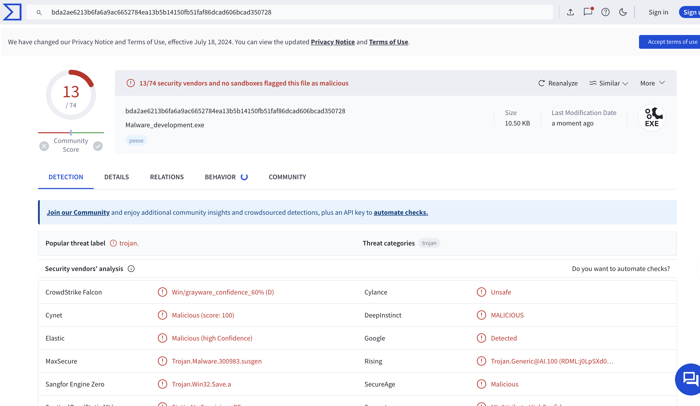

Remote Process Manipulation and Memory Dumping
This project demonstrates how to manipulate remote processes on Windows using WinAPI functions, allocate virtual memory in a target process, inject a DLL path, and create a memory dump of a specific process.

Libraries and Tools
Windows API (WinAPI)
Microsoft DbgHelp Library
Functionality
locateTargetProcess: Locates a target process by name and returns its Process ID (PID).
enablePrivilege: Enables a specified privilege for the current process.
generateMinDump: Generates a memory dump of the lsass.exe process.
MathOperations: Performs mathematical operations for code obfuscation.
Main: Loads a malicious DLL into a target process by manipulating memory and creates a memory dump.
Usage
Compile the code using a C++ compiler.
Run the compiled executable with administrative privileges.
The program will attempt to locate the target process, inject a malicious DLL path, and create a memory dump.
Security Considerations
Ensure that the program is run with appropriate permissions.
Be cautious when manipulating remote processes, as it may lead to unintended consequences.
Disclaimer
This code is for educational purposes only. Use it responsibly and at your own risk.

